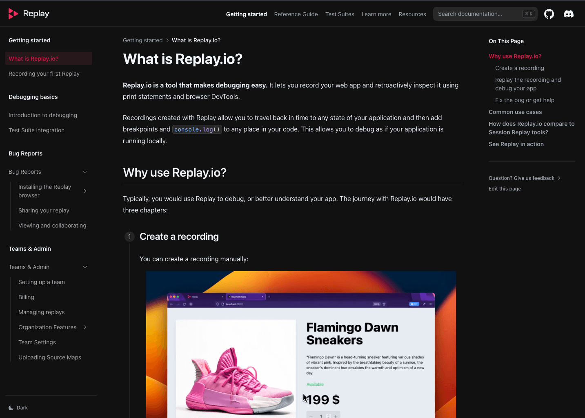

# OLD Replay.io documentation



A code repository for [https://docs.replay.io](https://docs.replay.io) containing Replay.io basics, tutorials, examples and explanations.

Docs are built with [Nextra](https://nextra.site/)

## Installation
```bash
pnpm i
```

## Local development
```
vercel dev
```
> Note: Using Vercel for local development ensures that some redirects work properly.

## Issues
If you find any issues, feel free to open a [new issue](https://github.com/replayio/replay-documentation/issues/new) or contact us [via Discord](https://docs.replay.io/discord).
